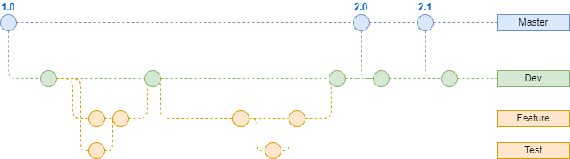

# Project VIOLET

The project now has been deployed, and avaialble on https://kv-redback.tk (Server Expired on Jan. 2023)

## Backgroud
This project is in collaboration with the Australian Clinical Dosimetry Service (ACDS), an organisation responsible for checking, testing, and verifying
ionizing radiation therapy and treatment machines across Australia and New Zealand.
The ACDS conducts audit on treatment machines to check that the radiation dose patients receive for their cancer treatment is within an acceptable
margin. They provide clinics with an official report whether they can continue to use the treatment machines to treat patients.
This project will be dealing with audits on low-energy ionizing machines (VIOLET – Voltage Integration Over Low Energy Therapy) that are used to treat
mainly skin cancers, see their website for more details. Each audit generates some data which is currently stored in two working Excel spreadsheets. One
spreadsheet is used to collect data during the audit at a specific clinic. Once the audit is complete, this data is added to the second spreadsheet so that all
the data from all past audits are in one place. The aggregated data is used for further comparative analysis and calculating results.
The goal of this project is to create and design a software application, with a database, to manage and calculate the physics data obtained for kV
radiotherapy audits performed by the Australian Clinical Dosimetry Service (ACDS) i.e., to convert the Excel spreadsheet into a software application and
database where the inputs from the facilities are stored securely on a database, the background calculations and interpolations that are essential for the
audit inputs are “hidden” from the user, and a user interface allows the user to input measurements and record experimental data during audits. With this
software application, audit information can be more efficiently managed, and with the audit results stored in one place, i.e., the database server, analysis
can be performed more effectively, potentially increasing productivity.

## Current status
- ~28/03/2022 - The team has finished the most of the requirement gathering, the development has begun.~
- ~30/04/2022 - The planned nightly release. Current nightly release comes with all major functionalities, and without any security features.~
- ~30/05/2022 - The planned stable release. All major functionalities will be tested, and security will be enhanced.~
- ~15/06/2022 - Review and release of documentation.~
- Project Done !!!

## Requirements
- Docker
- Node.js
- JDK8
- Maven

## Folder Structure
```

|-- VIOLET Initial // Intial code from client

|-- data samples // All the data (inputs) necessary to simulate/demonstrate prototypes

|-- docs // document files transfered from confluence, trello or other resources from KV-redback

|-- prototypes | -- low fidelity // original manuscript
               | -- high fidelity // digital prototype
               
|-- scr// Code resources folder

|-- tests // Tests code resources folder

|-- ui // User interface designs with different version

```

## Git Workflow
The workflow is simplified compare to mid-large scale project. There are mainly 4 types of branches:
1. Master: The stable release.
2. Dev: The development branch, which holds nightly release, it will become stable when the code is reviewed and thoroughly tested.
3. Feature: The feature branch(es), each feature branch should be spawned from the latest dev branch. The naming should be "{feature_name}-feature".
4. Test: The branches for testing purpose, there will be unit + integration testing in this project. For the unit testing, the naming should be "{feature_name}-feature-test". For the integration testing, the naming should be "Dev-test". Each testing branch will be finally merged with the corresponding feature/dev branch.

</img>

## Database
The database is provisioned in Microsoft SQL Server. The detail design of the database is only available for authenticated entity/individual and is hosted on project's conference site.

## Backend
Backend is provisioned in Spring Boot. The detail design of the backend is only available for authenticated entity/individual and is hosted on project's conference site.

## Frontend
Frontend is build using Vue CLI. The detail design of the frontend is only available for authenticated entity/individual and is hosted on project's conference site.

## Our team
| **Title**                                                               | Role                                                                                                                                                                                                      | Responsibilities                                                                                                                                                                                               |
|-------------------------------------------------------------------------|-----------------------------------------------------------------------------------------------------------------------------------------------------------------------------------------------------------|----------------------------------------------------------------------------------------------------------------------------------------------------------------------------------------------------------------|
| **Product Owner**<br>Xinyu Zeng<br>zexz1@student.unimelb.edu.au         | The product owner ensures the team delivers the most value to the client. <br>The product owner have a strong understanding of the project, which is used to prioritise user stories in upcoming sprints. | Maintain close ties with the client and seek their validation and input.<br>Communicate with the client - all emails, meeting invites, etc.<br>Guide the team to reach the client.<br>Set up meeting schedule. |
| **Scrum Master**<br>CALEB Wang<br>kaile@student.unimelb.edu.au          | The scrum master ensures the Scrum framework is followed. <br>The scrum master coaches the team rather than leading them - scrum masters are servant leaders.                                             | To ensure that they oversee how the project is tracking, and work to unblock developers to continue meeting objectives.                                                                                        |
| **Frontend lead**<br>Fangtai DONG<br>fangtaid@student.unimelb.edu.au    | The frontend leader is responsible for the frontend development of the project. <br>The frontend leader plays a key role in any decision-making about frontend architecture.                                        | Set up and configure the frontend codebase.                                                                                                                                                                    |
| **Backend lead**<br>Yipeng Li<br>yipengl@student.unimelb.edu.au         | The backend leader oversees the backend development of the project. <br>The backend leader plays a key role in any decision-making about backend architecture.                                            | Set up and configure the backend codebase.                                                                                                                                                                     |
| **Quality Assurance**<br>Haoran Zhao<br>haozhao1@student.unimelb.edu.au | The quality assurance monitors testing other initiatives to ensure the system is built to a high quality.                                                                                                 | Create a testing plan and ensure the testing objectives are met.                                                                                                                                               |                                                                                                                          |

## Acknowledgement
Thanks to ACDS and The University of Melbourne for this engaging project.
